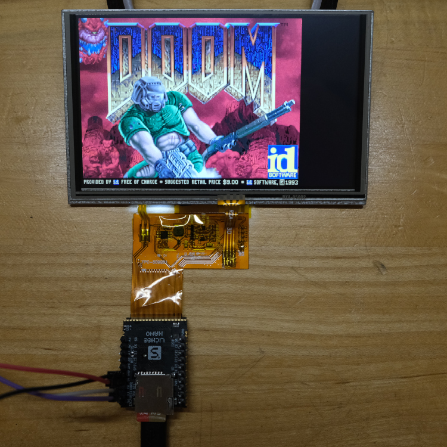

# LicheePi-Nano with LCD
Linux capable single board computer using the Allwinner F1C100s SoC
with 32MB of embedded RAM. 

This repo contains a Buildroot configuration to build a small, bootable
SD-Card image for the LicheePi Nano.



## Build

Clone this repo:
```
git clone https://github.com/mclewell/licheepi-nano-lcd
git submodule update --init
```
Change to the Buildroot directory:
```
cd licheepi-nano-lcd/software/buildroot
```
We will be doing an out-of-tree build. Make an directory for the output:
```
mkdir output-sd
cd output-sd
```
Set-up the build:
```
make -C ../ O=$(pwd) BR2_EXTERNAL=$PWD/../../ boysenboard_spi_defconfig
```
Start the build:
```
make
```

## Supported Features:
- LCD Panels (800x480) from the 40-pin FFC connector
- Resistive Touchscreen (Nsiway NS2009)
- Backlight control
	- sysfs export at: ```/sys/class/blacklight/blacklight```
	- ```echo [0-7] > brightness```
- USB Host Support (HID: mice, keyboards)
- Audio via on-chip codec and hardware pins (HPL, HPR, etc.)
	- See [LicheePi Nano schematic](docs/licheepi_nano_sch.pdf)
- Yes, it can run Doom!
	- run ```/usr/games/prboom```

